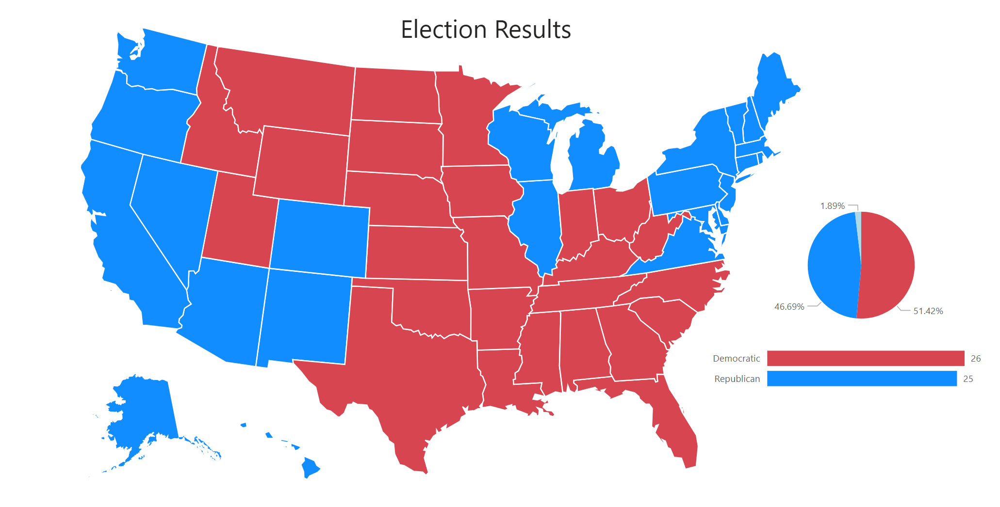
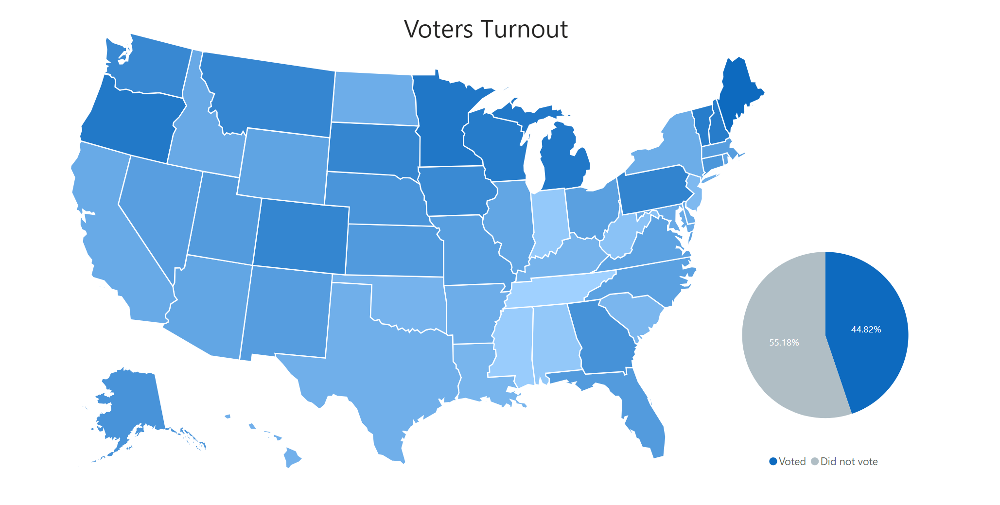

- [US Presidential Election Data Pipeline](#us-presidential-election-data-pipeline)
  - [Project Overview](#project-overview)
  - [Technologies Used](#technologies-used)
  - [Project Structure](#project-structure)
    - [1. Data Generation and Streaming:](#1-data-generation-and-streaming)
    - [2. Staging and Initial Processing:](#2-staging-and-initial-processing)
    - [3. Data Warehousing:](#3-data-warehousing)
    - [4. Data Visualization:](#4-data-visualization)
  - [Getting Started](#getting-started)
    - [1. Prerequisites:](#1-prerequisites)
    - [2. Setting up PostgreSQL:](#2-setting-up-postgresql)
    - [3. Setup Airflow:](#3-setup-airflow)
    - [4. Setup Snowflake:](#4-setup-snowflake)
    - [5. Start the pipeline](#5-start-the-pipeline)
    - [6. Visualization:](#6-visualization)
  - [Directory Structure](#directory-structure)


# US Presidential Election Data Pipeline
This project aims to simulate a US presidential election data pipeline using various technologies and tools for data streaming, ETL, data warehousing, and data visualization.

## Project Overview
The project involves the following components:
1. **Data Generation**: Using the randomuser API to generate simulated voter data.
2. **Data Streaming**: Utilizing Kafka for streaming voter registration and voting events.
3. **Staging and Transformation**: Storing data in a PostgreSQL staging database and transforming it using DBT.
4. **Data Visualization**: Visualizing election results and voter turnout using Tableau.
   
## Technologies Used
* **Python**: Python scripts are used to simulate registration and voting events. 
* **Flask API**: API provides registration and voting endpoints.
* **Apache Kafka**: For data streaming and event handling.
* **PostgreSQL**: Staging database for temporary storage.
* **Apache Airflow**: Orchestration of ETL tasks: incremental loading of data in PostgreSQL to Snowflake.
* **DBT (Data Build Tool)**: For data transformations.
* **Snowflake**: Data warehouse for storing transformed data.
* **Power BI**: Data visualization and dashboard creation.

## Project Structure
The project is structured into several stages:

### 1. Data Generation and Streaming:
Python scripts are used to simulate registration and voting events. The registration event producer script utilizes the randomuser API to create dummy voter data and sends it to the registration endpoint of the Flask API. The Flask API then produces the actual registration event into the Kafka stream. A registration consumer script then consumes these events and inserts the data to the appropriate Postgresql database. The same goes for voting events.

### 2. Staging and Initial Processing:
Data from Kafka is consumed and stored in a PostgreSQL staging database (election_db).
Two main tables: voters and votes, capturing voter registration details and voting events.
Using Airflow, data is incrementally loaded to Snowflake staging tables.

### 3. Data Warehousing:
DBT, orchestrated using Airflow, is used to transform data in Snowflake data warehouse.

### 4. Data Visualization:
Power BI is employed to create visualizations and dashboards for voter turnout and election results.

## Getting Started
To run this project locally or in your own environment, follow these steps:

### 1. Prerequisites:
* Docker installed for running containers
* Python version 3.11 environment for running simulated registration/voting events
* Snowflake account

### 2. Setting up PostgreSQL:
* After cloning the repository, we need to setup the PostgreSQL for the election staging database and airflow. Database setup is already handled using initialization script `db/init_db.sh`. Initialization scripts for PostgreSQL is only run when the database has no data yet so we gotta up it first before the rest of the services. Do this by running:
  ```bash
  $ docker compose up -d postgres
  ```

### 3. Setup Airflow:
* For Airflow, we are gonna use the docker-compose provided in [airflow.apache.org](#https://airflow.apache.org/docs/apache-airflow/stable/howto/docker-compose/index.html). To initialize the airflow service, run the commands below. The folders are needed for the airflow volumes.
  ```bash
  $ mkdir -p ./dags ./logs ./plugins ./config
  $ echo -e "AIRFLOW_UID=$(id -u)" > .env
  $ docker compose up airflow-init
  ```
* Once airflow init is done, we can now up the rest of the services by running:
  ```bash
  $ docker compose up -d
  ```
* Next, we need to setup the connections for ours dags in airflow. Go to [http://localhost:8080/connection/list/](#http://localhost:8080/connection/list/) and add the following connections:
  * postgres_conn  
    * Connection Id: postgres_conn
    * Connection Type: Postgres
    * Host: postgres
    * Database: election_db
    * Login: airflow
    * Passowrd: airflow
  * snowflake_conn
    * Connection Id: snowflake_conn
    * Connection Type: Snowflake
    * Schema: election_schema
    * Login: \<Snowflake username\>
    * Password: \<Snwoflake password\>
    * Account: \<Snowflake account identifier\>  (https://\<**this_value**\>.snowflakecomputing.com)
    * Warehouse: election_wh
    * Database: election_db
    * Role: dbt_role
  * snowflake_raw_conn
    * Connection Id: snowflake_raw_conn
    * Connection Type: Snowflake
    * Schema: election_schema
    * Login: \<Snowflake username\>
    * Password: \<Snwoflake password\>
    * Account: \<Snowflake account identifier\>  (https://\<**this_value**\>.snowflakecomputing.com)
    * Warehouse: election_wh
    * Database: election_db_raw
    * Role: dbt_role
  
### 4. Setup Snowflake:
* Scripts for Snowflake data warehouse setup and cleanup are in `snowflake_scripts`. 
* In Snowflake, create a new **SQL Worksheet**. Copy the commands in `snowflake_scripts/election_db_setup.sql` and paste it to the newly created SQL worksheet. Make sure to replace the username with the appropriate snowflake username. Run the commands and this should setup the ELECTION_DB. 
* For the ELECTION_DB_RAW, do the same process but use `snowflake_scripts/election_db_raw_setup.sql`. Snowflake Databases should now look like this:  


### 5. Start the pipeline
* Start the dags by unpausing them in the airflow dashboard.  

* install the required python packages:
  ```bash
  $ pip install -r requirements.txt
  ```
* The simulation of registration and voting events are written in such a way that it mimics the previous election turnout and results with 1:10000 ration. Values are detailed in `scripts/config.py`. 
* To simulate registration events. run the command below. This should populate the voters table. The corresponding consumer script is running the api service container.
  ```bash
  $ python scripts/registration_producer.py
  ```
* Once registration events are done, we can now start simulating the voting events by running:
  ```bash
  $ python scripts/vote_producer.py
  ```
* While registration and voting simulated events are running, the airflow dag that is loading the PostgreSQL tables to Snowflake and the airflow dag for the dbt transformations is already running in the background.

### 6. Visualization:
* Connect Power BI (or whatever visualization software you prefer) to Snowflake to create visualizations and dashboards. In fact, you can event set this up before starting the registration/voting simulation scripts. This will be provide you with semi-realtime election results.
  

## Directory Structure
```graphql
project-root/
├── airflow/                 # Airflow configuration
├── api/                     # Flask API configuration
├── dags/                    # Airflow DAGs
│   └── dbt/                 # dbt project
├── db/                      # database initialization scripts
├── docker-compose.yml       # Docker configuration for Kafka and PostgreSQL
├── README.md                # Project overview, setup instructions, and usage guide
├── snowflake_scripts        # Snowflake setup/cleanup scripts
└── scripts/                 # Scripts for data generation, Kafka producers/consumers
```
